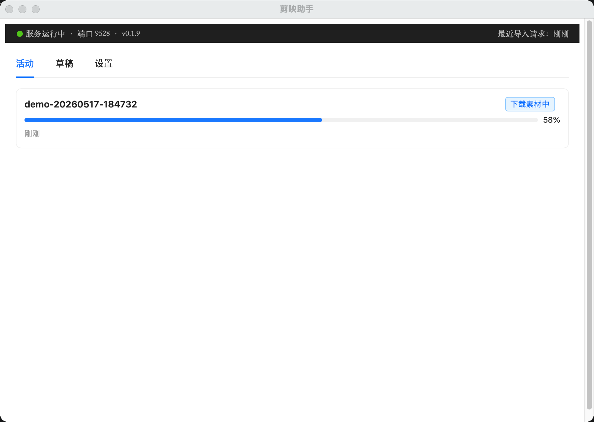

# capcut_helper

剪映外挂助手。本地 FastAPI 服务 + pywebview 桌面 GUI，支持把外部程序（如 ai-canvas）传来的时间线规格生成成剪映草稿。



详细设计：`docs/superpowers/specs/`。

## 仓库结构

- `backend/` —— FastAPI 后端，pytest 测试，pywebview 桌面壳入口
- `frontend/` —— React + Vite + Ant Design 5 GUI
- `scripts/` —— 构建/分发脚本
- `docs/` —— 设计文档（specs）+ 实现计划（plans）+ 调用方接入指南（CALLER_GUIDE）

## 开发

后端：

```bash
cd backend
uv sync
uv run pytest                  # 跑测试
uv run python -m app.main      # 启 pywebview 窗口（先 cd frontend && npm run build）
```

前端（开发态用 Vite dev server，自带 /api 代理到 127.0.0.1:9527）：

```bash
cd frontend
npm install
npm run dev                    # http://localhost:3176
npm run test                   # Vitest
```

## 运行行为

- **启动**：双击 `.app` / `.exe` → FastAPI 本地服务起来 + 状态栏 / 系统托盘出现图标 + 主窗口弹出
- **关闭窗口**（点 ×、Cmd+W、Alt+F4）：窗口隐藏到状态栏 / 托盘，FastAPI 服务**继续运行**，ai-canvas 等调用方仍可访问
- **打开面板**：左键点状态栏 / 托盘图标，或在菜单点「打开面板」
- **完整退出**（停止 FastAPI、释放端口）：
  - macOS：状态栏菜单「退出」、或 ⌘Q
  - Windows：托盘菜单「退出」

### 状态栏 / 托盘菜单

- v0.x.x（当前版本号，只读）
- 打开面板
- 检查更新...
- 退出

## 发版

### 一次性准备（只做一次）

1. 配 `origin` 远端到 GitHub 仓库（HTTPS 形式，凭据嵌 URL 或用系统 credential helper 都可以）
2. 在项目根放 `.github-token` 文件，内容是有 `contents:write` 权限的 fine-grained PAT（**已 gitignore**）
   - 生成路径：GitHub Settings → Developer settings → Personal access tokens → Fine-grained tokens
   - Repository access：只勾本仓库
   - Permissions → Repository → Contents：Read and write
3. **发 Windows 版前**：本机装 [Inno Setup 6](https://jrsoftware.org/isdl.php)（免费），`scripts/build_win.ps1` 自动定位 `C:\Program Files (x86)\Inno Setup 6\ISCC.exe`。如装在非默认位置，设环境变量 `ISCC_PATH` 指向 ISCC.exe。

### 每次发版

两端可独立发，谁先发都行；第二个发的会复用同一个 release 只补传自己平台的资产。

```bash
# 1. bump 版本号（任意一台机器都行）
vi backend/app/__init__.py        # 改 __version__ 为新版本，例如 "0.1.3"
git commit -am "chore: bump to 0.1.3"
git push                          # 让另一台机器能拿到 bump

# 2. 在 Mac 上发 dmg
bash scripts/release_mac.sh                   # 不带 release notes
bash scripts/release_mac.sh notes-0.1.3.md    # 用 markdown 文件作 release body

# 3. 在 Windows 上发 exe（在另一台 Win 机器上、先 git pull）
pwsh -File scripts/release_win.ps1                   # 不带 release notes
pwsh -File scripts/release_win.ps1 notes-0.1.3.md    # 用 markdown 文件作 release body
```

`scripts/release_mac.sh` 与 `scripts/release_win.ps1` 行为对称：跑测试 → 构建产物 → push main → push/复用 tag `v0.1.3` → 找或建 GitHub release → 上传自己平台的资产（`.dmg` / `.exe`）。失败时会指出已推 tag 怎么清理。

发布后，已装上旧版的同事下次启动 helper 时会自动看到「发现新版本 v0.1.3」横幅。

> **版本号 & 资产名约定**：tag 必须 `v` + SemVer（`update_checker._strip_v_prefix` 按这个格式解析）；资产名硬编码两个：
> - Mac：`capcut_helper-arm64-v<version>.dmg`（`scripts/build_mac.sh` 产物名 + `update_checker._asset_name_for_tag()` 在 darwin 分支返回）
> - Windows：`capcut_helper-x64-v<version>.exe`（Inno Setup `OutputBaseFilename` + `_asset_name_for_tag()` 在 win32 分支返回）

## 打包分发

### Mac

```bash
bash scripts/build_mac.sh
```

产物：

- `dist/capcut_helper.app` —— 双击运行
- `dist/capcut_helper-arm64-v<version>.dmg` —— 分发用，hdiutil 打 UDZO 压缩 dmg

### Windows

```powershell
pwsh -File scripts/build_win.ps1
```

产物：

- `dist/capcut_helper/capcut_helper.exe` —— 双击运行（调试 / 不走安装包时用）
- `dist/capcut_helper-x64-v<version>.exe` —— Inno Setup 安装包，分发给同事

## 分发给同事

把 `dist/capcut_helper-arm64-v<version>.dmg` 发给对方，请对方按以下步骤：

1. 双击 `capcut_helper-arm64-v<version>.dmg` 挂载
2. 在弹出的 Finder 窗口里把 `capcut_helper.app` 拖到旁边的 `Applications` 软链上
3. **首次打开**：因为未做代码签名，macOS 会拦截。**右键 → 打开 → 在弹窗里再点「打开」**，之后双击就行。或在「系统设置 → 隐私与安全」里允许。
4. **首次访问草稿目录时**，近版 macOS 会再弹一个文件夹访问权限提示（针对 `~/Movies` 或自定义草稿目录），点「允许」即可
5. 启动后第一次进 GUI，按「设置」标签里的「自动探测」找剪映草稿目录，或手动选择

应用窗口里的「活动」「草稿」「设置」三个标签——其中「设置」配剪映草稿根目录是首次必做的事。

### Windows 分发

把 `dist/capcut_helper-x64-v<version>.exe` 安装包发给对方，请对方按以下步骤：

1. 双击 `capcut_helper-x64-v<version>.exe`
2. **首次打开**：因为未做 EV 证书签名，Windows SmartScreen 会拦截，点「更多信息」→「仍要运行」
3. 安装向导：选位置（默认 `%LOCALAPPDATA%\Programs\capcut_helper`，不需管理员）→ Next → 完成；可勾「立即启动」
4. 之后从开始菜单找「capcut_helper」启动
5. **系统运行时依赖**（PyInstaller 已把 Python 3.13 打进 bundle，**不需装 Python**；但下面两个 Windows 系统运行时需要在）：
   - **WebView2 Runtime**：Win11 / 近一年 Win10 默认预装；若启动后窗口白屏，从 https://developer.microsoft.com/microsoft-edge/webview2/ 下「Evergreen Standalone Installer」装一次
   - **Visual C++ 2015-2022 Redistributable (x64)**：绝大多数 Windows 机器自带；若启动报「丢失 VCRUNTIME140.dll」，从 https://aka.ms/vs/17/release/vc_redist.x64.exe 下载安装
6. 启动后第一次进 GUI，按「设置」标签里的「自动探测」找剪映草稿目录，或手动选择

卸载：「设置 → 应用 → capcut_helper → 卸载」，或开始菜单里点「卸载 capcut_helper」。

## 已知限制

- 平台支持：macOS arm64（M 系列 Mac）和 Windows x64。Intel Mac 暂不支持，见 `docs/superpowers/specs/2026-05-15-capcut-helper-packaging-design.md` §9。
- 剪映 10.5+ 草稿编辑保存后会加密，capcut_helper 只能**新建**草稿、不能改剪映动过的草稿。详见 spec §2 实测约束。
- 状态栏 / 托盘图标当前为占位（mac 文字「剪映」、win PIL 动态画的占位图），正式图标 follow-up。
- 状态栏菜单「检查更新」会先打开面板再触发前端横幅 UI 处理；前端目前在启动时已自动检查，菜单点击不会强制重查（follow-up：前端监听 `capcut-helper:check-update` 自定义事件）。
- 异常退出（kill -9 / 系统强关）不做 graceful shutdown，正常退出请走状态栏「退出」或 macOS ⌘Q。
